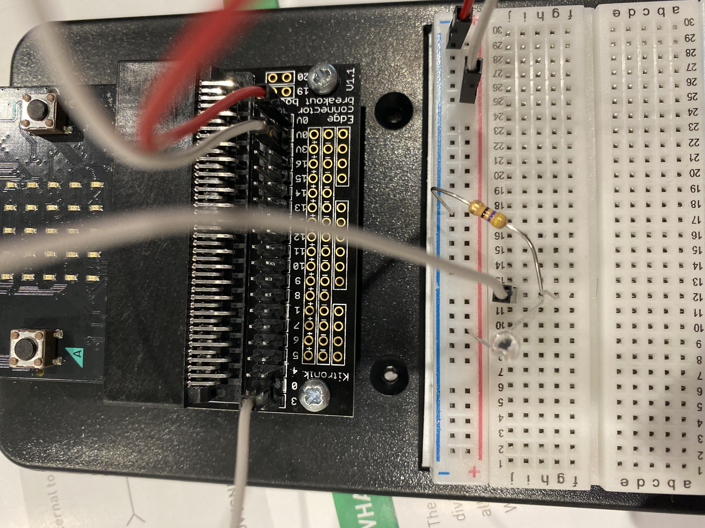
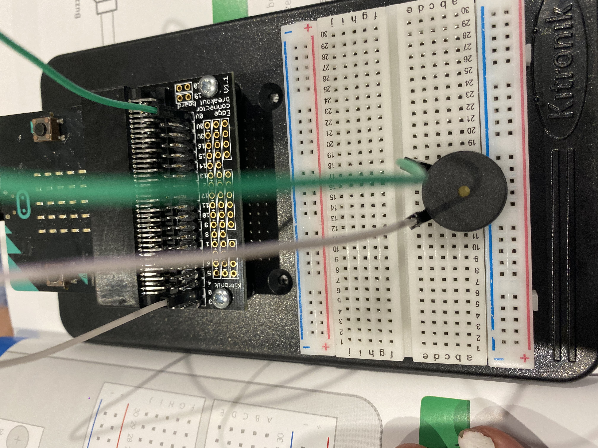

# Inventor Kit Experiments

*Markdown reference: https://guides.github.com/features/mastering-markdown/*

## Instructions ##

*For a selection of 5 inventor kit experiments that you choose, fill out the following sections.

### USING A LIGHT SENSOR AND ANALOG INPUTS ###

(Experiment 2)

#### Photo of completed project ####
*In the code below, replace `IMG-6569` with the name of the image, which should be in the `kitexperiments` folder.*

(bread-board for experiment 2)

#### Reflection ####

In this experiment, something new to me was or something I learned was how to use my first type of sensor.

This experiment could be the basis of a real world application such as, installing a light dimmer in a globe.

### SETTING THE TONE WITH A PIEZO BUZZER ###

(experiment 6)

#### Photo of completed project ####
In the code below, replace imagemissing.jpg with the name of the image, which should be in the kitexperiments folder.

(Insert a caption here)

#### Reflection ####

In this experiment, something new to me was or something I learned was how to use the music blocks.

This experiment could be the basis of a real world application such as creating music.

### MAKING A GAME USING THE COMPASS ###

(experiment 8)

#### Photo of completed project ####
In the code below, replace imagemissing.jpg with the name of the image, which should be in the kitexperiments folder.

(Insert a caption here)

#### Reflection ####

In this experiment, something new to me was or something I learned was how to incoperate user interaction with the experiment.

This experiment could be the basis of a real world application such as computer games.

### SAT'HELLO' TO THE BBC MICRO:BIT ###

(experiment 1)

#### Photo of completed project ####
In the code below, replace imagemissing.jpg with the name of the image, which should be in the kitexperiments folder.

(Insert a caption here)

#### Reflection ####

In this experiment, something new to me was or something I learned was how to use the basic micro-bit functions.

This experiment could be the basis of a real world application such as creating a circit.

### DIMMING AN LED USING S POTENTIOMETER ###

(experiment 3)

#### Photo of completed project ####
In the code below, replace imagemissing.jpg with the name of the image, which should be in the kitexperiments folder.

(Insert a caption here)

#### Reflection ####

In this experiment, something new to me was or something I learned was how to stop and start an action.

This experiment could be the basis of a real world application such as lighting a globe at the click of a switch.

