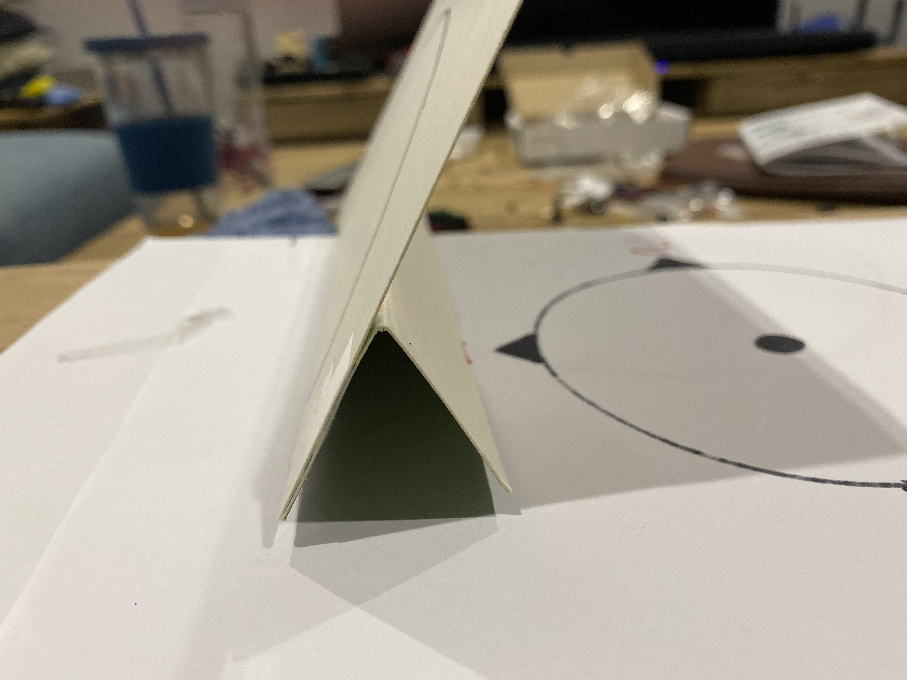
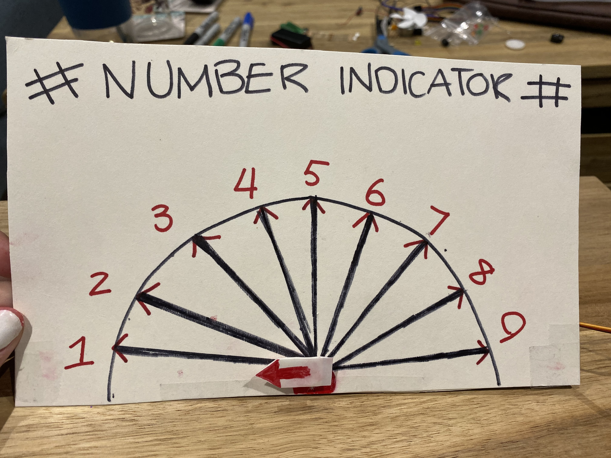

# Assessment 1: Replication project

*Fill out the following workbook with information relevant to your project.*

*Markdown reference:* [https://guides.github.com/features/mastering-markdown/](http://guides.github.com/features/mastering-markdown/)

## Replication project choice ##
(Tempreture Gauge)

## Related projects ##
*Find about 6 related projects to the project you choose. A project might be related through  function, technology, materials, fabrication, concept, or code. Don't forget to place an image of the related project in the* `replicationproject` *folder and insert the filename in the appropriate places below. Copy the markdown block of code below for each project you are showing, updating the number* `1` *in the subtitle for each.*

### Related project 1 ###
(Fidget Spinner speed test)

(https://www.youtube.com/watch?v=px_TGk7_XSQ)

This project is related to mine because (insert reasons here).

### Related project 2 ###
(Making a micro-bit compass)

(https://www.youtube.com/watch?v=tzK1AKUiGy0)

This project is related to mine because (insert reasons here).

### Related project 3 ###
(Micro-Bit Smoke Sensor)

(https://www.youtube.com/watch?v=9R0m2wuE5pI)

This project is related to mine because (insert reasons here).

### Related project 4 ###
(Simple Moisture Sensor Using BBC Micro:Bit)

(https://www.youtube.com/watch?v=rLNh1ph18Rs)

This project is related to mine because (insert reasons here).

### Related project 5 ###
(Making a micro:bit thermometer)

(https://www.youtube.com/watch?v=-fZm1JCvxlE)

This project is related to mine because (insert reasons here).

### Related project 6 ###
(How to Create Your Own Micro:bit Motion Detector)

(https://www.youtube.com/watch?v=7rBuhUxtuV8)

This project is related to mine because (insert reasons here).

## Reading reflections ##
*Reflective reading is an important part of actually making your reading worthwhile. Don't just read the words to understand what they say: read to see how the ideas in the text fit with and potentially change your existing knowledge and maybe even conceptual frameworks. We assume you can basically figure out what the readings mean, but the more important process is to understand how that changes what you think, particularly in the context of your project.*

*For each of the assigned readings, answer the questions below.*

### Reading: Don Norman, The Design of Everyday Things, Chapter 1 (The Psychopathology of Everyday Things) ###

*What I thought before: Describe something that you thought or believed before you read the source that was challenged by the reading.*

*What I learned: Describe what you now know or believe as a result of the reading. Don't just describe the reading: write about what changed in YOUR knowledge.*

*What I would like to know more about: Describe or write a question about something that you would be interested in knowing more about.*

*How this relates to the project I am working on: Describe the connection between the ideas in the reading and one of your current projects or how ideas in the reading could be used to improve your project.*

### Reading: Chapter 1 of Dan Saffer, Microinteractions: Designing with Details, Chapter 1 ###

*What I thought before: Describe something that you thought or believed before you read the source that was challenged by the reading.*

*What I learned: Describe what you now know or believe as a result of the reading. Don't just describe the reading: write about what changed in YOUR knowledge.*

*What I would like to know more about: Describe or write a question about something that you would be interested in knowing more about.*

*How this relates to the project I am working on: Describe the connection between the ideas in the reading and one of your current projects or how ideas in the reading could be used to improve your project.*

### Reading: Scott Sullivan, Prototyping Interactive Objects ###

*What I thought before: Describe something that you thought or believed before you read the source that was challenged by the reading.*

*What I learned: Describe what you now know or believe as a result of the reading. Don't just describe the reading: write about what changed in YOUR knowledge.*

*What I would like to know more about: Describe or write a question about something that you would be interested in knowing more about.*

*How this relates to the project I am working on: Describe the connection between the ideas in the reading and one of your current projects or how ideas in the reading could be used to improve your project.*

## Interaction flowchart ##
*Draw a flowchart of the interaction process in your project. Make sure you think about all the stages of interaction step-by-step. Also make sure that you consider actions a user might take that aren't what you intend in an ideal use case. Insert an image of it below. It might just be a photo of a hand-drawn sketch, not a carefully drawn digital diagram. It just needs to be legible.*

## Process documentation

*In this section, include text and images that represent the development of your project including sources you've found (URLs and written references), choices you've made, sketches you've done, iterations completed, materials you've investigated, and code samples. Use the markdown reference for help in formatting the material.*

*This should have quite a lot of information!*

*There will likely by a dozen or so images of the project under construction. The images should help explain why you've made the choices you've made as well as what you have done. Use the code below to include images, and copy it for each image, updating the information for each.*

First I used the Micro-Bit site to create the coding for the project, testing diffrent blocks to see what sort of sensor I could use that would work similarly to the tempreture gauge.When I attached the breadboard I used alot of the trial and error technique until i was able to move the servo in segments of 180 degrees. 

To display the numbers that the arrow attched to the servo was pointing at,I cut up a cardboard to create a gauge.

Through the back of the gauge, I attched the servo. Before starting up the project i had to make sure the servo and zero degress were alighned, in order to get an accurate reading.
*Include screenshots of the code you have used.*

## Project outcome ##

*Complete the following information.*

### Number Indicator ###

### Indicates the number lit up on the LED screen ###

*The 'Number Indictor' is used to indicate what number is shown on the Micro-bit LED screen. The invention counts up and down from one, to ten. An arrow attached to a servo points between zero and one hundread and eighty degrees, each eighteen degrees goes up a number.*

### Showcase image ###

*Try to capture the image as if it were in a portfolio, sales material, or project proposal. The project isn't likely to be something that finished, but practice making images that capture the project in that style.*

### Additional view ###

*Provide some other image that gives a viewer a different perspective on the project such as more about how it functions, the project in use, or something else.*

### Reflection ###

*The parts of the project that I felt were most sucsessful were the coding being able to programmed to stop and start at the press of button A and B. However,the parts that needed more work were mainly due to the servo not working properly. The servo struggled to move during most tests and twitched when landing on each number.*

*The sources I found most helpful when creating my project were videos online showing how to measure using diffrent sensors and the micro-bit manual. These gave me the direction and insight that I needed to use the tools I was provided with and understand how to use them*

*The ideas that helped me with creating my project come from alot of diffrent sources. For the majority of my project I used the micro-bit munual to learn the simple steps to using the mirco.bit site and created the coding through trialing diffrent blocks. I also used alot of youtube videos of other people making sensory projects using micro-bit, that guided me in the right direction. Such as (https://www.youtube.com/watch?v=px_TGk7_XSQ)*

*An intresting extention to this project might be to switch the servo to one that moves 360 degree's and have the numbers going up to 20 instead of 10. This could be used in the context of a spinner in a game show, that indicates a number generated from a computer*
